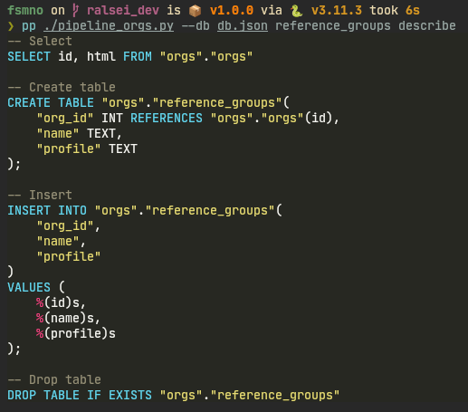

## Reference

Each script you create that uses [RalseiCli][ralsei.RalseiCli]
will have the following interface:

### Positional arguments

`task`

:   Name of a task or task sequence


`action`

:   - `run`
    - `delete`
    - `redo` - same as `delete` + `run`
    - `describe`
        * For a task, prints all the generated SQL scripts
        * For a sequence, prints the (resolved) task names

<figure markdown>

<figcaption markdown>Output of `describe` command</figcaption>
</figure>


### Optional arguments

`db`

:   Either a [`postgres://` URL](https://docs.sqlalchemy.org/en/20/core/engines.html#database-urls)

    or a json file with the database credentials:
    ```json
    {
      "username": "username",
      "password": "password",
      "host": "localhost",
      "port": 5432,
      "database": "fsmno"
    }
    ```

## Custom Arguments

With [RalseiCli.add_argument][ralsei.RalseiCli.add_argument]
you can add your own arguments
that are then passed to the pipeline factory function:

```py
def make_pipeline(args):
    TABLE_pages = Table("pages", args.schema)
    ...

if __name__ == "__main__":
    cli = RalseiCli() 
    cli.add_argument("-s", "--schema", default="orgs")

    cli.run(make_pipeline)
```
